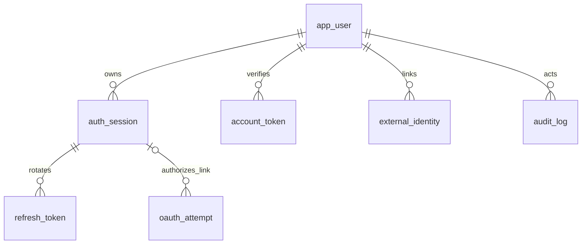

# BiletFlow backend

FastAPI + PostgreSQL implementation of authentication and Stage B event setup. Registration, Google sign-in, revocable sessions, organizer workspaces/invitations, scoped staff permissions, event discovery/publication, ticket-type configuration and predefined seating are implemented. Checkout, payments, refunds and admission remain upcoming.

[Organizer/event API guide](CATALOG_API.md) describes the new endpoints, permissions, flows, migration and remaining scope.

[Validation results and current local services](VALIDATION.md) records real PostgreSQL tests and running-API/local-SMTP checks.

## Run with Docker

1. Copy `.env.example` to `.env` in this directory. Set two different random signing/challenge secrets and two database passwords. Use URL-safe random values, for example `python -c "import secrets; print(secrets.token_urlsafe(48))"`. Never commit `.env`.
2. Run `docker compose up --build -d` from this directory.
3. Open [API documentation](http://localhost:8000/docs) and [local email inbox](http://localhost:8025).

Compose starts PostgreSQL 17, applies migrations and the fictional venue/category seed as `biletflow_owner`, provisions the restricted `biletflow_app` role, and starts the API, email worker and Mailpit. PostgreSQL data is kept in a named volume. `docker compose down` stops the services while retaining that volume. All published ports bind to localhost.

Database migrations are explicit; API startup never creates or drops tables. Re-running the migration is safe. The first migration requires a fresh `biletflow` schema: do not run it over the earlier 66-table reference DDL. Database history has no destructive downgrade command; use a reviewed backup/restore or a new development database.

## Run without Docker

Install Python 3.12+ and PostgreSQL 17. From `backend`, run `uv sync --frozen`. Create an empty database and set `DATABASE_URL` to an owner connection temporarily, plus `APP_DB_PASSWORD`, `JWT_SECRET`, and `CHALLENGE_SECRET`. Run:

```text
uv run python -m app.bootstrap
```

Then set `DATABASE_URL` to the `biletflow_app` connection and start these in separate terminals:

```text
uv run uvicorn app.main:create_app --factory --host 127.0.0.1 --port 8000 --no-access-log
uv run python -m app.worker
```

Set SMTP configuration for your local mail viewer or transactional provider. The email worker retries failed delivery and retains exhausted jobs; registration itself does not depend on SMTP being available. The local demonstration uses Mailpit, never external email delivery.

Authentication emails currently use an English fallback template; the stored profile locale is available for later localized client/email templates.

## Try registration and sign-in

In `/docs`, use these operations in order:

1. `POST /api/v1/auth/register`: email, display name, password of 12–128 characters, and optional `kk`, `ru` or `en` locale. Names cannot be blank. Duplicate registration returns the same response and cannot replace an existing password.
2. Read the verification email in Mailpit. Copy the value after `#token=` into `POST /api/v1/auth/verify-email`. The eventual frontend will read that fragment and submit the token; those frontend pages are not part of this backend task.
3. `POST /api/v1/auth/login`: email, password, `client_kind: "web"` or `"scanner"`. Unverified and suspended users cannot sign in.
4. Copy `access_token` into Swagger's **Authorize** field. Call `GET /api/v1/me` or the session endpoints.

Use `POST /password/forgot` then the emailed token with `POST /password/reset` for recovery. Verification lasts 24 hours; password reset lasts 30 minutes. Resending replaces the prior challenge. Successful reset revokes every existing session. A Google-only account can deliberately add a password through this verified-email recovery flow.

## Token and session contract

- Access tokens are HS256-signed JWTs, valid for up to 10 minutes. They are encoded and readable, not encrypted. Claims contain account/session IDs, issuer, audience, purpose, timestamps and a random JWT ID; no password, email or profile data. Access JWTs are not stored in the database.
- Every protected operation checks the current verified active user and unrevoked, unexpired session in PostgreSQL. Reset/logout/suspension therefore block old JWTs immediately on the next request. Suspension also revokes sessions at the database level, so reinstatement does not revive them.
- Refresh tokens are random 256-bit opaque secrets, separate from access JWTs. Only SHA-256 digests are retained in `auth_session` and `refresh_token`. Their high entropy makes a fast digest appropriate; passwords use salted Argon2id instead.
- Refresh rotation consumes the old digest and inserts a new one under the account/session lock. Reusing an old genuine token revokes that session. A guessed token cannot revoke somebody else's session. Clients must serialize refresh requests; concurrent duplicates can force reauthentication. An uncertain/lost refresh response requires signing in again.
- Sessions expire absolutely after 30 days by default; rotation never extends that deadline.
- **Web:** refresh token is an HttpOnly, SameSite=Strict cookie restricted to `/api/v1/auth`; the JSON refresh field is null. Call `/refresh` with `{}`, `credentials: "include"`, and an allowed `Origin`. Keep access tokens in memory. Use the same site for web/API deployments with this cookie policy. Local HTTP explicitly uses `COOKIE_SECURE=false`; production requires secure cookies and HTTPS.
- **Scanner:** refresh token is returned in JSON. Keep it in the OS protected credential store and send it as `refresh_token` to `/refresh`. Access tokens use `Authorization: Bearer ...` for both client types.
- Logout requires the access token. `/logout-all` revokes all sessions; deleting `/sessions/{id}` revokes one owned session. Session listings are paginated and contain no hashes or bearer tokens.

No raw passwords, refresh tokens or emailed tokens appear in outbox/audit payloads. Email secrets are regenerated from a purpose-bound challenge ID and a separate HMAC key only when the worker dispatches the message. Protect and back up that key with the database; changing it invalidates outstanding challenges.

## Enable Google sign-in

Create a **Web application** OAuth client in Google Cloud, configure the consent screen/test users, and set:

```dotenv
GOOGLE_CLIENT_ID=your-client-id.apps.googleusercontent.com
GOOGLE_CLIENT_SECRET=your-client-secret
GOOGLE_REDIRECT_URI=http://localhost:8000/api/v1/auth/google/callback
```

Register that exact redirect URI in Google Cloud. Restart the API after changing settings. Use `localhost` consistently: starting on `127.0.0.1` and returning to `localhost` loses the browser-binding cookie.

1. In the same browser, `POST /api/v1/auth/google/start` and open the returned `authorization_url`.
2. Google returns an authorization code to the configured callback. The backend verifies the one-use state and browser cookie, exchanges the code with PKCE, validates Google's RS256 signature/JWKS, issuer, audience, authorized party, expiry, nonce and verified email, and creates the BiletFlow session.
3. The backend callback returns the access-token JSON and sets the web refresh cookie. Provider access/refresh tokens are never persisted.

For a frontend integration, the registered `GOOGLE_REDIRECT_URI` can instead point to the frontend's fixed callback page. That page submits Google's `code` and `state` to this backend's callback with credentials included and consumes the returned access token. Add the frontend origin to `ALLOWED_ORIGINS`; both start and callback requests must preserve the same API cookies. No arbitrary redirect URI is accepted from users.

Google `sub` is the stable identity key. Matching email alone never links accounts. If a password account already exists, sign in normally and call authenticated `POST /google/link`, then complete Google authorization. The callback rechecks the original session and refuses a Google identity already owned by another account. Linking is explicit; unlinking is outside this task.

Without Google credentials, start/link returns `503 google_not_configured`. Automated tests verify signed token validation and the OAuth lifecycle with mocked network exchanges. A real Google consent/browser round trip still requires your credentials.

References: [Google OpenID Connect](https://developers.google.com/identity/openid-connect/openid-connect), [FastAPI JWT and password hashing](https://fastapi.tiangolo.com/tutorial/security/oauth2-jwt/).

## Database relations and transactions

The `biletflow` schema now has 27 tables across `0001_identity` and `0002_event_setup`. The nine identity/supporting tables below originate in `migrations/versions/0001_identity.sql`; the [catalogue guide](CATALOG_API.md#database-and-transaction-contract) describes the 18 additional tables.

| Table | Purpose and relationships |
|---|---|
| `app_user` | Unique normalized email; nullable Argon2id password for Google-only identities; verified timestamp, locale, status and consent |
| `auth_session` | Many sessions per user; FK to user, unique current refresh digest, absolute expiry, revocation, client kind |
| `refresh_token` | Many issued refresh digests per session; FK to session, globally unique digest, consumed timestamp |
| `account_token` | Many one-use challenges per user; FK to user, constrained purpose, unique digest, expiry, consumption |
| `external_identity` | FK to user; unique `(provider, subject)` and `(user_id, provider)` |
| `oauth_attempt` | One-use hashed state and browser binding; optional FK to the session authorizing account linking |
| `auth_rate_bucket` | Shared database-backed fixed-window counters using keyed digests for IP/email keys |
| `audit_log` | Append-only authentication events with actor-user FK; no credentials or profile payloads |
| `outbox_job` | Durable email intent, retry count and fenced worker lease; payload references challenge ID |



UUID primary keys and creation timestamps are server defaults. All FKs use RESTRICT; no account/history deletion API exists. Unique email and identity constraints backstop application locks. User locks precede session/challenge locks; creation/linking also uses identity advisory locks. Account creation, challenge creation and email/audit intent commit together. Password reset and session revocation commit together. Rate counters commit independently, including rejected attempts. Remote Google/SMTP calls occur outside domain transactions.

Workers claim with `FOR UPDATE SKIP LOCKED`, release the transaction before SMTP, and acknowledge only the current unexpired lease. Up to five attempts are allowed; failed/uncertain sends may be repeated, as SMTP cannot guarantee exactly-once delivery. The same single-use challenge remains authoritative.

The original draw.io atlas remains the full-product design baseline. This implementation makes `password_hash` nullable and adds four supporting auth tables. `0002_event_setup` replaces the temporary authentication-only scope CHECKs with organization/event FKs in shared audit/outbox. Permission records retain revocation timestamps. Run the bootstrap after upgrading to grant the runtime role access to the added tables and seed the predefined catalogue. Do not infer that all 66 planned tables are deployed.

## Tests

Create a **separate empty PostgreSQL database whose name ends in `_test`**, owned by a test role with migration/role-creation rights. Set `TEST_DATABASE_URL` to its `postgresql+psycopg://...` URL. The suite refuses other database names and truncates all 27 implemented tables. Never point it at a shared or valuable database.

```text
uv sync --frozen
uv run pytest -q --cov=app --cov-report=term-missing
uv run ruff check app tests migrations
uv run ruff format --check app tests migrations
```

When using the generated local `.env`, load its test URL for the run:

```text
uv run python -c "from dotenv import load_dotenv; load_dotenv(); import pytest; raise SystemExit(pytest.main(['-q']))"
```

Tests cover the full account flow, SQL relationships and audit immutability, token forgery/expiry/purpose, cookie CSRF protections, replay, session ownership, email retries/leases, shared rate limits, restricted-role permissions, rollback, concurrent registration/verification/refresh, reset-versus-refresh, and Google cryptographic validation/account linking. They use independent real PostgreSQL connections; no SQLite substitute. The suite also covers organizer isolation, invitation acceptance/replay, delegation limits, private/unlisted discovery, event lifecycle, seating, allocation capacity guards and transaction rollback. CI is configured to repeat these checks on PostgreSQL 17.

Deploy behind HTTPS, preserve secret-free logging, and configure trusted proxy handling explicitly if needed. The default rate limiter uses the connection peer IP, not untrusted forwarded headers. Audit/outbox/auth history is retained in this academic implementation; retention cleanup remains an explicit future policy. Platform-admin endpoints remain planned. Organizer/event endpoints and their limitations are documented in [CATALOG_API.md](CATALOG_API.md).
